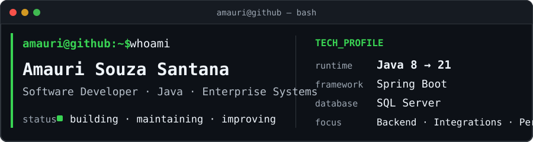
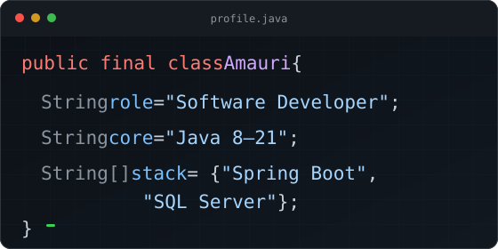

  

  

## `> sobre_mim`

Sou **Desenvolvedor de Software** com foco no ecossistema **Java**.

Meu trabalho passa por diferentes camadas de aplicações corporativas:

- **backend e frontend**;
- **integrações e APIs**;
- **SQL Server**, procedures e triggers;
- rotinas automatizadas;
- performance e qualidade de código.

  

## `> stack_principal`

  
  &nbsp;&nbsp;&nbsp;
  
  &nbsp;&nbsp;&nbsp;
  
  &nbsp;&nbsp;&nbsp;
  
  &nbsp;&nbsp;&nbsp;
  
  &nbsp;&nbsp;&nbsp;
  
  &nbsp;&nbsp;&nbsp;
  

  
  
  
  

  
  
  
  

  <code>JSF</code> · <code>JPA</code> · <code>JDBC</code> · <code>POO</code> · <code>SOLID</code> · <code>Procedures</code> · <code>Triggers</code> · <code>APIs</code>

## `> github_activity`

<table>
  <tr>
    <td width="50%" align="center" valign="middle">
      
    </td>
    <td width="50%" align="center" valign="middle">
      
    </td>
  </tr>
</table>

## `> lab`

<table>
  <tr>
    <td width="90" align="center" valign="middle">
      
    </td>
    <td valign="middle">
      <strong>REST APIs</strong> 
      Estudos e projetos pessoais voltados ao desenvolvimento e consumo de APIs REST.
    </td>
  </tr>
</table>

## `> connect`

  

